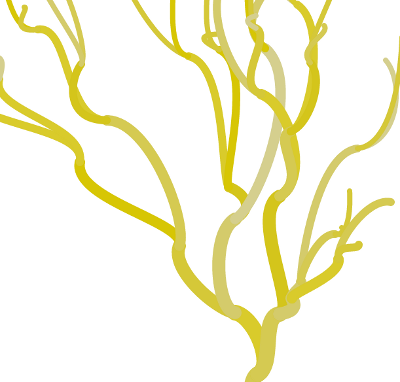

# plantlife

A decorative vine-growing animation written in Clojurescript using the
Om framework.

## Description

The vine is a strange plant that has no leaves and can be easily
modeled as a balanced binary tree.

See it working [here](http://josf.github.io/plantlife)

## License

Copyright © 2014 Joseph Fahey

Distributed under the Eclipse Public License either version 1.0 or (at
your option) any later version.
